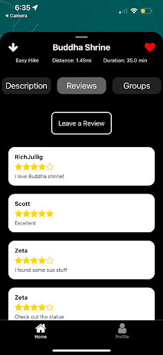

# Hike Review: Find and Share Your Next Adventure

Hike Review is a mobile application designed to connect outdoor enthusiasts in Santa Cruz with their next favorite trail. Discover local hikes through an interactive map, get detailed trail information, read community-driven reviews, and even organize group hikes with friends or fellow adventurers.

## Features

* **Interactive Trail Map:** Visually discover nearby trails with map markers.
* **Detailed Information:** Access comprehensive details for each hike, including distance, estimated duration, difficulty, and user-submitted photos.
* **User Authentication & Profiles:** Sign up and log in to create a personalized profile that tracks your favorite trails and scheduled hikes.
* **Community Reviews:** Share your experience and read honest reviews from other hikers to find the perfect trail for you.
* **Group Hikes:** A unique feature that allows users to create, find, and join group hikes for any trail, fostering a sense of community.

---

## Discover and Explore

The home page provides the main interface for finding new trails. Users can explore a dynamic map to see all available hikes in their vicinity or scroll through a clean, card-based list that highlights key trail information at a glance.

<table align="center">
  <tr>
    <td></td>
    <td width="20"></td>
    <td></td>
  </tr>
</table>

---

## Detailed Trail Information

Once a trail sparks your interest, tap in to see everything you need to know. View the trail's path overlaid on the map and switch to the description tab to read about its unique features, terrain, and what to expect on your journey. If you're logged in, you can "like" a hike to add it to your favorites.

<table align="center">
  <tr>
    <td></td>
    <td width="20"></td>
    <td></td>
  </tr>
</table>

---

## Personalized User Profiles

Create an account to unlock personalized features. The profile page serves as your hiking dashboard, keeping a list of your favorite trails for quick access and showing all your upcoming scheduled hikes. Logging in allows you to like trails, leave reviews, and access groups.

<table align="center">
  <tr>
    <td></td>
    <td width="20"></td>
    <td></td>
  </tr>
</table>

---

## Community-Driven Reviews

Make informed decisions with the help of the community. Read reviews and check star ratings left by other hikers. After your hike, contribute back by leaving your own review and rating to help others discover great trails.

<table align="center">
  <tr>
    <td></td>
    <td width="20"></td>
    <!-- As HRSub.png was not provided, I'm using a descriptive alt text for a placeholder or future image -->
    <td></td>
  </tr>
</table>

---

## Organize and Join Group Hikes

Hiking is better together! Our Groups feature allows you to see all planned group hikes for a specific trail. You can easily join an existing group or take the lead and create a new one, complete with a custom name, description, and start time.

<table align="center">
  <tr>
    <td></td>
    <td width="20"></td>
    <td></td>
    <td width="20"></td>
    <td></td>
  </tr>
</table>

---

## Codebase

This project is organized into two main repositories:

* **[React-Native](https://github.com/Hike-Review/React-Native):** This repository contains the mobile application's front-end. It is built using the **React Native** framework and written in **TypeScript**.This codebase is responsible for rendering all user interface components, managing application state, handling user navigation, and communicating with the back-end API. Note that the front-end application is not currently deployed.

* **[MySQL](https://github.com/Hike-Review/MySQL):** This repository holds all back-end components. It features a RESTful API built with the **Flask** framework in **Python**, which processes requests from the mobile app. It also contains the `schema.sql`, setting the mySQL database structure. Both the API and database are hosted via **Google Cloud Platform** services (Cloud Run and Cloud SQL). Other files in this repository include testing scripts, hike csv data, GCP cloud run configuration, and API documentation.
---

## Contact

Avtesh Singh - [avtesh13@gmail.com](mailto:avtesh13@gmail.com)
